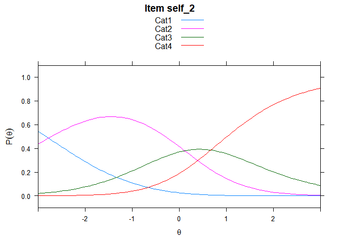

Untitled
================

GitHub Documents
----------------

This is an R Markdown format used for publishing markdown documents to GitHub. When you click the **Knit** button all R code chunks are run and a markdown file (.md) suitable for publishing to GitHub is generated.

Including Code
--------------

You can include R code in the document as follows:

``` r
hls2 <- read.csv("data_pre.csv", header = T)
str(hls2)
```

    ## 'data.frame':    748 obs. of  45 variables:
    ##  $ X           : int  1 2 3 4 5 6 7 8 9 10 ...
    ##  $ 癤풹chieve_1: int  0 0 0 2 1 1 3 3 1 3 ...
    ##  $ achieve_2   : int  2 3 2 2 2 1 2 1 0 2 ...
    ##  $ achieve_3   : int  1 2 4 2 0 3 4 0 2 1 ...
    ##  $ achieve_4   : int  0 2 1 0 0 1 2 0 2 1 ...
    ##  $ achieve_5   : int  0 0 1 1 0 1 3 0 1 2 ...
    ##  $ achieve_6   : int  3 2 1 2 2 1 2 0 2 1 ...
    ##  $ self_1      : int  0 0 2 2 1 0 0 0 2 2 ...
    ##  $ self_2      : int  2 4 0 0 2 1 0 0 4 1 ...
    ##  $ self_3      : int  3 0 0 0 0 1 0 0 2 1 ...
    ##  $ self_4      : int  2 4 3 0 2 2 4 0 2 1 ...
    ##  $ self_5      : int  3 4 1 0 2 3 2 4 3 1 ...
    ##  $ self_6      : int  2 3 0 2 0 0 0 0 1 0 ...
    ##  $ self_7      : int  1 0 1 0 1 0 1 1 1 1 ...
    ##  $ self_8      : int  0 0 3 0 2 3 1 1 3 2 ...
    ##  $ curio_1     : int  0 0 1 0 0 0 0 0 4 0 ...
    ##  $ curio_2     : int  0 0 1 0 0 1 0 0 0 0 ...
    ##  $ curio_3     : int  1 0 3 0 0 2 0 4 4 0 ...
    ##  $ curio_4     : int  1 0 1 0 0 0 0 4 0 1 ...
    ##  $ curio_5     : int  1 0 0 4 1 1 0 1 0 1 ...
    ##  $ curio_6     : int  0 0 0 4 2 2 0 0 0 1 ...
    ##  $ curio_7     : int  1 0 0 0 0 0 0 0 0 1 ...
    ##  $ curio_8     : int  2 0 1 2 1 3 0 4 0 4 ...
    ##  $ curio_9     : int  1 0 0 2 0 0 0 0 0 1 ...
    ##  $ curio_10    : int  0 0 0 4 2 0 0 4 0 0 ...
    ##  $ curio_11    : int  0 0 0 0 0 0 0 0 0 1 ...
    ##  $ info_1      : int  0 0 0 0 0 0 0 0 0 0 ...
    ##  $ info_2      : int  0 0 1 0 1 0 0 1 0 0 ...
    ##  $ info_3      : int  0 0 1 0 0 0 0 0 0 1 ...
    ##  $ info_4      : int  0 0 0 0 0 0 2 0 1 2 ...
    ##  $ info_5      : int  0 0 0 0 0 0 0 1 0 0 ...
    ##  $ info_6      : int  2 0 1 0 2 0 2 0 0 3 ...
    ##  $ inter_d_1   : int  1 0 2 4 4 4 2 4 2 2 ...
    ##  $ inter_d_2   : int  1 4 0 2 4 3 2 4 2 1 ...
    ##  $ inter_d_3   : int  2 4 1 2 4 3 2 4 2 2 ...
    ##  $ inter_d_4   : int  1 0 2 1 4 1 4 4 2 0 ...
    ##  $ inter_d_5   : int  1 4 2 2 0 1 2 0 2 0 ...
    ##  $ inter_d_6   : int  0 0 4 2 0 3 2 0 2 2 ...
    ##  $ inter_d_7   : int  0 0 3 0 0 1 0 1 2 1 ...
    ##  $ inter_d_8   : int  0 0 0 3 0 2 0 0 2 1 ...
    ##  $ deci_1      : int  3 4 1 1 4 1 4 4 2 3 ...
    ##  $ deci_2      : int  3 0 2 2 4 4 2 0 2 3 ...
    ##  $ deci_3      : int  2 4 4 2 4 4 4 3 2 3 ...
    ##  $ deci_4      : int  2 2 0 2 2 2 4 4 2 4 ...
    ##  $ deci_5      : int  2 2 4 4 3 2 4 3 2 4 ...

``` r
hls2 <- hls2[2:45]

hls2[hls2 =="2"]<- 1
hls2[hls2 =="3"]<- 2
hls2[hls2 =="4"]<- 3
hls2[hls2 =="5"]<- 4
```

``` r
mod2 <- tam(hls2)
```

    ## ....................................................
    ## Processing Data      2020-08-31 11:56:55 
    ##     * Response Data: 748 Persons and  44 Items 
    ##     * Numerical integration with 21 nodes
    ##     * Created Design Matrices   ( 2020-08-31 11:56:55 )
    ##     * Calculated Sufficient Statistics   ( 2020-08-31 11:56:55 )
    ## ....................................................
    ## Iteration 1     2020-08-31 11:56:55
    ## E Step
    ## M Step Intercepts   |----
    ##   Deviance = 70480.0111
    ##   Maximum item intercept parameter change: 0.759179
    ##   Maximum item slope parameter change: 0
    ##   Maximum regression parameter change: 0
    ##   Maximum variance parameter change: 0.175026
    ## ....................................................
    ## Iteration 2     2020-08-31 11:56:55
    ## E Step
    ## M Step Intercepts   |----
    ##   Deviance = 69443.3031 | Absolute change: 1036.708 | Relative change: 0.01492884
    ##   Maximum item intercept parameter change: 0.419781
    ##   Maximum item slope parameter change: 0
    ##   Maximum regression parameter change: 0
    ##   Maximum variance parameter change: 0.18086
    ## ....................................................
    ## Iteration 3     2020-08-31 11:56:55
    ## E Step
    ## M Step Intercepts   |----
    ##   Deviance = 69335.0981 | Absolute change: 108.2049 | Relative change: 0.00156061
    ##   Maximum item intercept parameter change: 0.448931
    ##   Maximum item slope parameter change: 0
    ##   Maximum regression parameter change: 0
    ##   Maximum variance parameter change: 0.063909
    ## ....................................................
    ## Iteration 4     2020-08-31 11:56:55
    ## E Step
    ## M Step Intercepts   |----
    ##   Deviance = 69312.3932 | Absolute change: 22.7049 | Relative change: 0.00032757
    ##   Maximum item intercept parameter change: 0.082251
    ##   Maximum item slope parameter change: 0
    ##   Maximum regression parameter change: 0
    ##   Maximum variance parameter change: 0.026111
    ## ....................................................
    ## Iteration 5     2020-08-31 11:56:55
    ## E Step
    ## M Step Intercepts   |----
    ##   Deviance = 69309.0535 | Absolute change: 3.3397 | Relative change: 4.819e-05
    ##   Maximum item intercept parameter change: 0.053537
    ##   Maximum item slope parameter change: 0
    ##   Maximum regression parameter change: 0
    ##   Maximum variance parameter change: 0.009448
    ## ....................................................
    ## Iteration 6     2020-08-31 11:56:55
    ## E Step
    ## M Step Intercepts   |----
    ##   Deviance = 69308.4777 | Absolute change: 0.5758 | Relative change: 8.31e-06
    ##   Maximum item intercept parameter change: 0.016746
    ##   Maximum item slope parameter change: 0
    ##   Maximum regression parameter change: 0
    ##   Maximum variance parameter change: 0.003764
    ## ....................................................
    ## Iteration 7     2020-08-31 11:56:55
    ## E Step
    ## M Step Intercepts   |----
    ##   Deviance = 69308.3266 | Absolute change: 0.1511 | Relative change: 2.18e-06
    ##   Maximum item intercept parameter change: 0.003708
    ##   Maximum item slope parameter change: 0
    ##   Maximum regression parameter change: 0
    ##   Maximum variance parameter change: 0.001421
    ## ....................................................
    ## Iteration 8     2020-08-31 11:56:55
    ## E Step
    ## M Step Intercepts   |----
    ##   Deviance = 69308.2667 | Absolute change: 0.0599 | Relative change: 8.6e-07
    ##   Maximum item intercept parameter change: 0.001935
    ##   Maximum item slope parameter change: 0
    ##   Maximum regression parameter change: 0
    ##   Maximum variance parameter change: 0.000631
    ## ....................................................
    ## Iteration 9     2020-08-31 11:56:55
    ## E Step
    ## M Step Intercepts   |----
    ##   Deviance = 69308.2278 | Absolute change: 0.0389 | Relative change: 5.6e-07
    ##   Maximum item intercept parameter change: 0.001261
    ##   Maximum item slope parameter change: 0
    ##   Maximum regression parameter change: 0
    ##   Maximum variance parameter change: 0.000237
    ## ....................................................
    ## Iteration 10     2020-08-31 11:56:55
    ## E Step
    ## M Step Intercepts   |----
    ##   Deviance = 69308.197 | Absolute change: 0.0308 | Relative change: 4.4e-07
    ##   Maximum item intercept parameter change: 0.000984
    ##   Maximum item slope parameter change: 0
    ##   Maximum regression parameter change: 0
    ##   Maximum variance parameter change: 7.7e-05
    ## ....................................................
    ## Iteration 11     2020-08-31 11:56:55
    ## E Step
    ## M Step Intercepts   |----
    ##   Deviance = 69308.1715 | Absolute change: 0.0255 | Relative change: 3.7e-07
    ##   Maximum item intercept parameter change: 0.000835
    ##   Maximum item slope parameter change: 0
    ##   Maximum regression parameter change: 0
    ##   Maximum variance parameter change: 1.6e-05
    ## ....................................................
    ## Iteration 12     2020-08-31 11:56:55
    ## E Step
    ## M Step Intercepts   |----
    ##   Deviance = 69308.1504 | Absolute change: 0.0212 | Relative change: 3.1e-07
    ##   Maximum item intercept parameter change: 0.000741
    ##   Maximum item slope parameter change: 0
    ##   Maximum regression parameter change: 0
    ##   Maximum variance parameter change: 7e-06
    ## ....................................................
    ## Iteration 13     2020-08-31 11:56:55
    ## E Step
    ## M Step Intercepts   |----
    ##   Deviance = 69308.1328 | Absolute change: 0.0176 | Relative change: 2.5e-07
    ##   Maximum item intercept parameter change: 0.000683
    ##   Maximum item slope parameter change: 0
    ##   Maximum regression parameter change: 0
    ##   Maximum variance parameter change: 1.4e-05
    ## ....................................................
    ## Iteration 14     2020-08-31 11:56:55
    ## E Step
    ## M Step Intercepts   |----
    ##   Deviance = 69308.1181 | Absolute change: 0.0146 | Relative change: 2.1e-07
    ##   Maximum item intercept parameter change: 0.000626
    ##   Maximum item slope parameter change: 0
    ##   Maximum regression parameter change: 0
    ##   Maximum variance parameter change: 1.6e-05
    ## ....................................................
    ## Iteration 15     2020-08-31 11:56:55
    ## E Step
    ## M Step Intercepts   |----
    ##   Deviance = 69308.106 | Absolute change: 0.0122 | Relative change: 1.8e-07
    ##   Maximum item intercept parameter change: 0.000572
    ##   Maximum item slope parameter change: 0
    ##   Maximum regression parameter change: 0
    ##   Maximum variance parameter change: 1.6e-05
    ## ....................................................
    ## Iteration 16     2020-08-31 11:56:55
    ## E Step
    ## M Step Intercepts   |----
    ##   Deviance = 69308.0959 | Absolute change: 0.0101 | Relative change: 1.5e-07
    ##   Maximum item intercept parameter change: 0.000522
    ##   Maximum item slope parameter change: 0
    ##   Maximum regression parameter change: 0
    ##   Maximum variance parameter change: 1.5e-05
    ## ....................................................
    ## Iteration 17     2020-08-31 11:56:55
    ## E Step
    ## M Step Intercepts   |----
    ##   Deviance = 69308.0874 | Absolute change: 0.0084 | Relative change: 1.2e-07
    ##   Maximum item intercept parameter change: 0.000476
    ##   Maximum item slope parameter change: 0
    ##   Maximum regression parameter change: 0
    ##   Maximum variance parameter change: 1.4e-05
    ## ....................................................
    ## Iteration 18     2020-08-31 11:56:55
    ## E Step
    ## M Step Intercepts   |----
    ##   Deviance = 69308.0804 | Absolute change: 0.007 | Relative change: 1e-07
    ##   Maximum item intercept parameter change: 0.000434
    ##   Maximum item slope parameter change: 0
    ##   Maximum regression parameter change: 0
    ##   Maximum variance parameter change: 1.3e-05
    ## ....................................................
    ## Iteration 19     2020-08-31 11:56:55
    ## E Step
    ## M Step Intercepts   |----
    ##   Deviance = 69308.0746 | Absolute change: 0.0058 | Relative change: 8e-08
    ##   Maximum item intercept parameter change: 0.000396
    ##   Maximum item slope parameter change: 0
    ##   Maximum regression parameter change: 0
    ##   Maximum variance parameter change: 1.2e-05
    ## ....................................................
    ## Iteration 20     2020-08-31 11:56:55
    ## E Step
    ## M Step Intercepts   |----
    ##   Deviance = 69308.0698 | Absolute change: 0.0048 | Relative change: 7e-08
    ##   Maximum item intercept parameter change: 0.000361
    ##   Maximum item slope parameter change: 0
    ##   Maximum regression parameter change: 0
    ##   Maximum variance parameter change: 1.1e-05
    ## ....................................................
    ## Iteration 21     2020-08-31 11:56:55
    ## E Step
    ## M Step Intercepts   |----
    ##   Deviance = 69308.0658 | Absolute change: 0.004 | Relative change: 6e-08
    ##   Maximum item intercept parameter change: 0.000329
    ##   Maximum item slope parameter change: 0
    ##   Maximum regression parameter change: 0
    ##   Maximum variance parameter change: 1e-05
    ## ....................................................
    ## Iteration 22     2020-08-31 11:56:55
    ## E Step
    ## M Step Intercepts   |----
    ##   Deviance = 69308.0624 | Absolute change: 0.0033 | Relative change: 5e-08
    ##   Maximum item intercept parameter change: 3e-04
    ##   Maximum item slope parameter change: 0
    ##   Maximum regression parameter change: 0
    ##   Maximum variance parameter change: 9e-06
    ## ....................................................
    ## Iteration 23     2020-08-31 11:56:55
    ## E Step
    ## M Step Intercepts   |----
    ##   Deviance = 69308.0597 | Absolute change: 0.0028 | Relative change: 4e-08
    ##   Maximum item intercept parameter change: 0.000274
    ##   Maximum item slope parameter change: 0
    ##   Maximum regression parameter change: 0
    ##   Maximum variance parameter change: 8e-06
    ## ....................................................
    ## Iteration 24     2020-08-31 11:56:55
    ## E Step
    ## M Step Intercepts   |----
    ##   Deviance = 69308.0574 | Absolute change: 0.0023 | Relative change: 3e-08
    ##   Maximum item intercept parameter change: 0.000249
    ##   Maximum item slope parameter change: 0
    ##   Maximum regression parameter change: 0
    ##   Maximum variance parameter change: 8e-06
    ## ....................................................
    ## Iteration 25     2020-08-31 11:56:55
    ## E Step
    ## M Step Intercepts   |----
    ##   Deviance = 69308.0554 | Absolute change: 0.0019 | Relative change: 3e-08
    ##   Maximum item intercept parameter change: 0.000227
    ##   Maximum item slope parameter change: 0
    ##   Maximum regression parameter change: 0
    ##   Maximum variance parameter change: 7e-06
    ## ....................................................
    ## Iteration 26     2020-08-31 11:56:55
    ## E Step
    ## M Step Intercepts   |----
    ##   Deviance = 69308.0539 | Absolute change: 0.0016 | Relative change: 2e-08
    ##   Maximum item intercept parameter change: 0.000207
    ##   Maximum item slope parameter change: 0
    ##   Maximum regression parameter change: 0
    ##   Maximum variance parameter change: 6e-06
    ## ....................................................
    ## Iteration 27     2020-08-31 11:56:55
    ## E Step
    ## M Step Intercepts   |----
    ##   Deviance = 69308.0525 | Absolute change: 0.0013 | Relative change: 2e-08
    ##   Maximum item intercept parameter change: 0.000189
    ##   Maximum item slope parameter change: 0
    ##   Maximum regression parameter change: 0
    ##   Maximum variance parameter change: 6e-06
    ## ....................................................
    ## Iteration 28     2020-08-31 11:56:55
    ## E Step
    ## M Step Intercepts   |---
    ##   Deviance = 69308.0514 | Absolute change: 0.0011 | Relative change: 2e-08
    ##   Maximum item intercept parameter change: 0.000217
    ##   Maximum item slope parameter change: 0
    ##   Maximum regression parameter change: 0
    ##   Maximum variance parameter change: 5e-06
    ## ....................................................
    ## Iteration 29     2020-08-31 11:56:55
    ## E Step
    ## M Step Intercepts   |---
    ##   Deviance = 69308.0504 | Absolute change: 0.001 | Relative change: 1e-08
    ##   Maximum item intercept parameter change: 0.000173
    ##   Maximum item slope parameter change: 0
    ##   Maximum regression parameter change: 0
    ##   Maximum variance parameter change: 4e-06
    ## ....................................................
    ## Iteration 30     2020-08-31 11:56:55
    ## E Step
    ## M Step Intercepts   |---
    ##   Deviance = 69308.0496 | Absolute change: 8e-04 | Relative change: 1e-08
    ##   Maximum item intercept parameter change: 0.000155
    ##   Maximum item slope parameter change: 0
    ##   Maximum regression parameter change: 0
    ##   Maximum variance parameter change: 5e-06
    ## ....................................................
    ## Iteration 31     2020-08-31 11:56:55
    ## E Step
    ## M Step Intercepts   |---
    ##   Deviance = 69308.0489 | Absolute change: 7e-04 | Relative change: 1e-08
    ##   Maximum item intercept parameter change: 0.00014
    ##   Maximum item slope parameter change: 0
    ##   Maximum regression parameter change: 0
    ##   Maximum variance parameter change: 4e-06
    ## ....................................................
    ## Iteration 32     2020-08-31 11:56:55
    ## E Step
    ## M Step Intercepts   |---
    ##   Deviance = 69308.0484 | Absolute change: 5e-04 | Relative change: 1e-08
    ##   Maximum item intercept parameter change: 0.000127
    ##   Maximum item slope parameter change: 0
    ##   Maximum regression parameter change: 0
    ##   Maximum variance parameter change: 4e-06
    ## ....................................................
    ## Iteration 33     2020-08-31 11:56:55
    ## E Step
    ## M Step Intercepts   |---
    ##   Deviance = 69308.0479 | Absolute change: 4e-04 | Relative change: 1e-08
    ##   Maximum item intercept parameter change: 0.000114
    ##   Maximum item slope parameter change: 0
    ##   Maximum regression parameter change: 0
    ##   Maximum variance parameter change: 4e-06
    ## ....................................................
    ## Iteration 34     2020-08-31 11:56:55
    ## E Step
    ## M Step Intercepts   |---
    ##   Deviance = 69308.0476 | Absolute change: 4e-04 | Relative change: 1e-08
    ##   Maximum item intercept parameter change: 0.000103
    ##   Maximum item slope parameter change: 0
    ##   Maximum regression parameter change: 0
    ##   Maximum variance parameter change: 3e-06
    ## ....................................................
    ## Iteration 35     2020-08-31 11:56:55
    ## E Step
    ## M Step Intercepts   |--
    ##   Deviance = 69308.0473 | Absolute change: 3e-04 | Relative change: 0
    ##   Maximum item intercept parameter change: 8.4e-05
    ##   Maximum item slope parameter change: 0
    ##   Maximum regression parameter change: 0
    ##   Maximum variance parameter change: 3e-06
    ## ....................................................
    ## Item Parameters
    ##     xsi.index         xsi.label     est
    ## 1           1 癤풹chieve_1_Cat1 -3.2280
    ## 2           2 癤풹chieve_1_Cat2 -0.3550
    ## 3           3 癤풹chieve_1_Cat3  0.2696
    ## 4           4    achieve_2_Cat1 -4.5058
    ## 5           5    achieve_2_Cat2  0.4740
    ## 6           6    achieve_2_Cat3  1.2194
    ## 7           7    achieve_3_Cat1 -2.6902
    ## 8           8    achieve_3_Cat2  0.1663
    ## 9           9    achieve_3_Cat3  0.8971
    ## 10         10    achieve_4_Cat1 -2.2091
    ## 11         11    achieve_4_Cat2  0.6612
    ## 12         12    achieve_4_Cat3  0.8710
    ## 13         13    achieve_5_Cat1 -4.0805
    ## 14         14    achieve_5_Cat2 -0.3019
    ## 15         15    achieve_5_Cat3  1.2159
    ## 16         16    achieve_6_Cat1 -3.7802
    ## 17         17    achieve_6_Cat2  0.1340
    ## 18         18    achieve_6_Cat3  1.6420
    ## 19         19       self_1_Cat1 -2.9236
    ## 20         20       self_1_Cat2  0.2585
    ## 21         21       self_1_Cat3  1.3315
    ## 22         22       self_2_Cat1 -2.7806
    ## 23         23       self_2_Cat2  0.1139
    ## 24         24       self_2_Cat3  0.6672
    ## 25         25       self_3_Cat1 -3.0810
    ## 26         26       self_3_Cat2  0.1777
    ## 27         27       self_3_Cat3  1.1693
    ## 28         28       self_4_Cat1 -2.9543
    ## 29         29       self_4_Cat2 -0.3086
    ## 30         30       self_4_Cat3  0.9907
    ## 31         31       self_5_Cat1 -3.3227
    ## 32         32       self_5_Cat2 -0.8422
    ## 33         33       self_5_Cat3  0.6311
    ## 34         34       self_6_Cat1 -2.0570
    ## 35         35       self_6_Cat2  0.8285
    ## 36         36       self_6_Cat3  0.5766
    ## 37         37       self_7_Cat1 -2.9643
    ## 38         38       self_7_Cat2  0.3932
    ## 39         39       self_7_Cat3  1.2549
    ## 40         40       self_8_Cat1 -3.4864
    ## 41         41       self_8_Cat2 -0.8382
    ## 42         42       self_8_Cat3  0.4383
    ## 43         43      curio_1_Cat1 -2.8646
    ## 44         44      curio_1_Cat2 -0.4153
    ## 45         45      curio_1_Cat3  0.6438
    ## 46         46      curio_2_Cat1 -3.1425
    ## 47         47      curio_2_Cat2  0.0741
    ## 48         48      curio_2_Cat3  0.7412
    ## 49         49      curio_3_Cat1 -2.8022
    ## 50         50      curio_3_Cat2 -0.2840
    ## 51         51      curio_3_Cat3  0.6943
    ## 52         52      curio_4_Cat1 -2.7856
    ## 53         53      curio_4_Cat2  0.5117
    ## 54         54      curio_4_Cat3  0.6115
    ## 55         55      curio_5_Cat1 -2.5967
    ## 56         56      curio_5_Cat2  0.1564
    ## 57         57      curio_5_Cat3  0.6134
    ## 58         58      curio_6_Cat1 -2.8740
    ## 59         59      curio_6_Cat2 -0.3258
    ## 60         60      curio_6_Cat3  0.7381
    ## 61         61      curio_7_Cat1 -2.7943
    ## 62         62      curio_7_Cat2  0.4786
    ## 63         63      curio_7_Cat3  0.8309
    ## 64         64      curio_8_Cat1 -3.0019
    ## 65         65      curio_8_Cat2  0.1593
    ## 66         66      curio_8_Cat3  0.7961
    ## 67         67      curio_9_Cat1 -2.5973
    ## 68         68      curio_9_Cat2 -0.0169
    ## 69         69      curio_9_Cat3  0.7026
    ## 70         70     curio_10_Cat1 -2.7523
    ## 71         71     curio_10_Cat2  0.2246
    ## 72         72     curio_10_Cat3  0.6416
    ## 73         73     curio_11_Cat1 -2.8399
    ## 74         74     curio_11_Cat2  0.5558
    ## 75         75     curio_11_Cat3  0.7035
    ## 76         76       info_1_Cat1 -1.7876
    ## 77         77       info_1_Cat2  2.0418
    ## 78         78       info_1_Cat3  1.3132
    ## 79         79       info_2_Cat1 -2.6297
    ## 80         80       info_2_Cat2  1.4142
    ## 81         81       info_2_Cat3  1.2908
    ## 82         82       info_3_Cat1 -2.0695
    ## 83         83       info_3_Cat2  1.4961
    ## 84         84       info_3_Cat3  1.9767
    ## 85         85       info_4_Cat1 -2.8140
    ## 86         86       info_4_Cat2  0.9086
    ## 87         87       info_4_Cat3  1.0833
    ## 88         88       info_5_Cat1 -2.2260
    ## 89         89       info_5_Cat2  1.1659
    ## 90         90       info_5_Cat3  1.0717
    ## 91         91       info_6_Cat1 -2.9918
    ## 92         92       info_6_Cat2  0.3494
    ## 93         93       info_6_Cat3  0.8057
    ## 94         94    inter_d_1_Cat1 -2.9949
    ## 95         95    inter_d_1_Cat2 -0.3430
    ## 96         96    inter_d_1_Cat3  0.6197
    ## 97         97    inter_d_2_Cat1 -2.3914
    ## 98         98    inter_d_2_Cat2  0.0651
    ## 99         99    inter_d_2_Cat3  0.6121
    ## 100       100    inter_d_3_Cat1 -3.0769
    ## 101       101    inter_d_3_Cat2 -0.1943
    ## 102       102    inter_d_3_Cat3  0.7262
    ## 103       103    inter_d_4_Cat1 -2.4856
    ## 104       104    inter_d_4_Cat2 -0.0063
    ## 105       105    inter_d_4_Cat3  0.7407
    ## 106       106    inter_d_5_Cat1 -3.1725
    ## 107       107    inter_d_5_Cat2  0.6600
    ## 108       108    inter_d_5_Cat3  0.8441
    ## 109       109    inter_d_6_Cat1 -2.1655
    ## 110       110    inter_d_6_Cat2  0.5209
    ## 111       111    inter_d_6_Cat3  0.8749
    ## 112       112    inter_d_7_Cat1 -2.9660
    ## 113       113    inter_d_7_Cat2  0.3261
    ## 114       114    inter_d_7_Cat3  1.0616
    ## 115       115    inter_d_8_Cat1 -2.7379
    ## 116       116    inter_d_8_Cat2  0.3196
    ## 117       117    inter_d_8_Cat3  1.2066
    ## 118       118       deci_1_Cat1 -2.7743
    ## 119       119       deci_1_Cat2 -0.1616
    ## 120       120       deci_1_Cat3  0.6618
    ## 121       121       deci_2_Cat1 -2.6876
    ## 122       122       deci_2_Cat2  0.2747
    ## 123       123       deci_2_Cat3  1.1393
    ## 124       124       deci_3_Cat1 -2.8653
    ## 125       125       deci_3_Cat2 -0.2976
    ## 126       126       deci_3_Cat3  0.5580
    ## 127       127       deci_4_Cat1 -2.9782
    ## 128       128       deci_4_Cat2 -0.2321
    ## 129       129       deci_4_Cat3  0.4694
    ## 130       130       deci_5_Cat1 -2.9540
    ## 131       131       deci_5_Cat2 -0.1507
    ## 132       132       deci_5_Cat3  0.7328
    ## ...................................
    ## Regression Coefficients
    ##      [,1]
    ## [1,]    0
    ## 
    ## Variance:
    ##        [,1]
    ## [1,] 0.5387
    ## 
    ## 
    ## EAP Reliability:
    ## [1] 0.923
    ## 
    ## -----------------------------
    ## Start:  2020-08-31 11:56:55
    ## End:  2020-08-31 11:56:55 
    ## Time difference of 0.234334 secs

``` r
summary(mod2)
```

    ## ------------------------------------------------------------
    ## TAM 3.5-19 (2020-05-05 22:45:39) 
    ## R version 3.6.2 (2019-12-12) x86_64, mingw32 | nodename=DESKTOP-JS5S97D | login=Park Jung 
    ## 
    ## Date of Analysis: 2020-08-31 11:56:55 
    ## Time difference of 0.234334 secs
    ## Computation time: 0.234334 
    ## 
    ## Multidimensional Item Response Model in TAM 
    ## 
    ## IRT Model: 1PL
    ## Call:
    ## tam.mml(resp = resp)
    ## 
    ## ------------------------------------------------------------
    ## Number of iterations = 35 
    ## Numeric integration with 21 integration points
    ## 
    ## Deviance = 69308.05 
    ## Log likelihood = -34654.02 
    ## Number of persons = 748 
    ## Number of persons used = 748 
    ## Number of items = 44 
    ## Number of estimated parameters = 133 
    ##     Item threshold parameters = 132 
    ##     Item slope parameters = 0 
    ##     Regression parameters = 0 
    ##     Variance/covariance parameters = 1 
    ## 
    ## AIC = 69574  | penalty=266    | AIC=-2*LL + 2*p 
    ## AIC3 = 69707  | penalty=399    | AIC3=-2*LL + 3*p 
    ## BIC = 70188  | penalty=880.11    | BIC=-2*LL + log(n)*p 
    ## aBIC = 69765  | penalty=457.08    | aBIC=-2*LL + log((n-2)/24)*p  (adjusted BIC) 
    ## CAIC = 70321  | penalty=1013.11    | CAIC=-2*LL + [log(n)+1]*p  (consistent AIC) 
    ## AICc = 69632  | penalty=324.05    | AICc=-2*LL + 2*p + 2*p*(p+1)/(n-p-1)  (bias corrected AIC) 
    ## GHP = 1.05697     | GHP=( -LL + p ) / (#Persons * #Items)  (Gilula-Haberman log penalty) 
    ## 
    ## ------------------------------------------------------------
    ## EAP Reliability
    ## [1] 0.923
    ## ------------------------------------------------------------
    ## Covariances and Variances
    ##       [,1]
    ## [1,] 0.539
    ## ------------------------------------------------------------
    ## Correlations and Standard Deviations (in the diagonal)
    ##       [,1]
    ## [1,] 0.734
    ## ------------------------------------------------------------
    ## Regression Coefficients
    ##      [,1]
    ## [1,]    0
    ## ------------------------------------------------------------
    ## Item Parameters -A*Xsi
    ##            item   N     M xsi.item AXsi_.Cat1 AXsi_.Cat2 AXsi_.Cat3 B.Cat1.Dim1
    ## 1  癤풹chieve_1 748 1.973   -1.104     -3.228     -3.583     -3.313           1
    ## 2     achieve_2 748 1.580   -0.937     -4.506     -4.032     -2.812           1
    ## 3     achieve_3 748 1.662   -0.542     -2.690     -2.524     -1.627           1
    ## 4     achieve_4 748 1.488   -0.226     -2.209     -1.548     -0.677           1
    ## 5     achieve_5 748 1.778   -1.055     -4.080     -4.382     -3.166           1
    ## 6     achieve_6 748 1.598   -0.668     -3.780     -3.646     -2.004           1
    ## 7        self_1 748 1.576   -0.444     -2.924     -2.665     -1.333           1
    ## 8        self_2 748 1.729   -0.666     -2.781     -2.667     -1.999           1
    ## 9        self_3 748 1.631   -0.578     -3.081     -2.903     -1.734           1
    ## 10       self_4 748 1.789   -0.757     -2.954     -3.263     -2.272           1
    ## 11       self_5 748 2.009   -1.178     -3.323     -4.165     -3.534           1
    ## 12       self_6 748 1.480   -0.217     -2.057     -1.228     -0.652           1
    ## 13       self_7 748 1.553   -0.439     -2.964     -2.571     -1.316           1
    ## 14       self_8 748 2.057   -1.295     -3.486     -4.324     -3.886           1
    ## 15      curio_1 748 1.885   -0.879     -2.865     -3.280     -2.636           1
    ## 16      curio_2 748 1.742   -0.776     -3.142     -3.068     -2.327           1
    ## 17      curio_3 748 1.836   -0.797     -2.802     -3.086     -2.392           1
    ## 18      curio_4 748 1.626   -0.554     -2.786     -2.274     -1.662           1
    ## 19      curio_5 748 1.717   -0.609     -2.597     -2.440     -1.827           1
    ## 20      curio_6 748 1.841   -0.820     -2.874     -3.200     -2.461           1
    ## 21      curio_7 748 1.592   -0.495     -2.794     -2.316     -1.485           1
    ## 22      curio_8 748 1.701   -0.682     -3.002     -2.842     -2.046           1
    ## 23      curio_9 748 1.747   -0.637     -2.597     -2.614     -1.911           1
    ## 24     curio_10 748 1.701   -0.629     -2.752     -2.528     -1.886           1
    ## 25     curio_11 748 1.598   -0.527     -2.840     -2.284     -1.580           1
    ## 26       info_1 748 1.068    0.523     -1.788      0.254      1.568           1
    ## 27       info_2 748 1.275    0.025     -2.630     -1.215      0.075           1
    ## 28       info_3 748 1.148    0.468     -2.069     -0.573      1.404           1
    ## 29       info_4 748 1.434   -0.274     -2.814     -1.905     -0.822           1
    ## 30       info_5 748 1.325    0.004     -2.226     -1.060      0.012           1
    ## 31       info_6 748 1.644   -0.612     -2.992     -2.642     -1.836           1
    ## 32    inter_d_1 748 1.877   -0.906     -2.995     -3.338     -2.718           1
    ## 33    inter_d_2 748 1.729   -0.571     -2.391     -2.326     -1.714           1
    ## 34    inter_d_3 748 1.817   -0.848     -3.077     -3.271     -2.545           1
    ## 35    inter_d_4 748 1.729   -0.584     -2.486     -2.492     -1.751           1
    ## 36    inter_d_5 748 1.559   -0.556     -3.172     -2.512     -1.668           1
    ## 37    inter_d_6 748 1.523   -0.257     -2.165     -1.644     -0.770           1
    ## 38    inter_d_7 748 1.603   -0.526     -2.966     -2.640     -1.578           1
    ## 39    inter_d_8 748 1.568   -0.404     -2.738     -2.418     -1.212           1
    ## 40       deci_1 748 1.807   -0.758     -2.774     -2.936     -2.274           1
    ## 41       deci_2 748 1.588   -0.424     -2.688     -2.413     -1.273           1
    ## 42       deci_3 748 1.873   -0.868     -2.865     -3.163     -2.605           1
    ## 43       deci_4 748 1.881   -0.914     -2.978     -3.210     -2.741           1
    ## 44       deci_5 748 1.798   -0.791     -2.954     -3.105     -2.372           1
    ##    B.Cat2.Dim1 B.Cat3.Dim1
    ## 1            2           3
    ## 2            2           3
    ## 3            2           3
    ## 4            2           3
    ## 5            2           3
    ## 6            2           3
    ## 7            2           3
    ## 8            2           3
    ## 9            2           3
    ## 10           2           3
    ## 11           2           3
    ## 12           2           3
    ## 13           2           3
    ## 14           2           3
    ## 15           2           3
    ## 16           2           3
    ## 17           2           3
    ## 18           2           3
    ## 19           2           3
    ## 20           2           3
    ## 21           2           3
    ## 22           2           3
    ## 23           2           3
    ## 24           2           3
    ## 25           2           3
    ## 26           2           3
    ## 27           2           3
    ## 28           2           3
    ## 29           2           3
    ## 30           2           3
    ## 31           2           3
    ## 32           2           3
    ## 33           2           3
    ## 34           2           3
    ## 35           2           3
    ## 36           2           3
    ## 37           2           3
    ## 38           2           3
    ## 39           2           3
    ## 40           2           3
    ## 41           2           3
    ## 42           2           3
    ## 43           2           3
    ## 44           2           3
    ## 
    ## Item Parameters Xsi
    ##                      xsi se.xsi
    ## 癤풹chieve_1_Cat1 -3.228  0.257
    ## 癤풹chieve_1_Cat2 -0.355  0.085
    ## 癤풹chieve_1_Cat3  0.270  0.086
    ## achieve_2_Cat1    -4.506  0.382
    ## achieve_2_Cat2     0.474  0.080
    ## achieve_2_Cat3     1.219  0.115
    ## achieve_3_Cat1    -2.690  0.177
    ## achieve_3_Cat2     0.166  0.080
    ## achieve_3_Cat3     0.897  0.102
    ## achieve_4_Cat1    -2.209  0.137
    ## achieve_4_Cat2     0.661  0.082
    ## achieve_4_Cat3     0.871  0.110
    ## achieve_5_Cat1    -4.080  0.358
    ## achieve_5_Cat2    -0.302  0.081
    ## achieve_5_Cat3     1.216  0.104
    ## achieve_6_Cat1    -3.780  0.282
    ## achieve_6_Cat2     0.134  0.079
    ## achieve_6_Cat3     1.642  0.124
    ## self_1_Cat1       -2.924  0.190
    ## self_1_Cat2        0.259  0.080
    ## self_1_Cat3        1.332  0.116
    ## self_2_Cat1       -2.781  0.188
    ## self_2_Cat2        0.114  0.081
    ## self_2_Cat3        0.667  0.097
    ## self_3_Cat1       -3.081  0.207
    ## self_3_Cat2        0.178  0.080
    ## self_3_Cat3        1.169  0.109
    ## self_4_Cat1       -2.954  0.216
    ## self_4_Cat2       -0.309  0.082
    ## self_4_Cat3        0.991  0.099
    ## self_5_Cat1       -3.323  0.295
    ## self_5_Cat2       -0.842  0.089
    ## self_5_Cat3        0.631  0.088
    ## self_6_Cat1       -2.057  0.129
    ## self_6_Cat2        0.829  0.084
    ## self_6_Cat3        0.577  0.106
    ## self_7_Cat1       -2.964  0.190
    ## self_7_Cat2        0.393  0.080
    ## self_7_Cat3        1.255  0.116
    ## self_8_Cat1       -3.486  0.322
    ## self_8_Cat2       -0.838  0.091
    ## self_8_Cat3        0.438  0.085
    ## curio_1_Cat1      -2.865  0.216
    ## curio_1_Cat2      -0.415  0.084
    ## curio_1_Cat3       0.644  0.091
    ## curio_2_Cat1      -3.142  0.220
    ## curio_2_Cat2       0.074  0.081
    ## curio_2_Cat3       0.741  0.097
    ## curio_3_Cat1      -2.802  0.204
    ## curio_3_Cat2      -0.284  0.082
    ## curio_3_Cat3       0.694  0.093
    ## curio_4_Cat1      -2.786  0.177
    ## curio_4_Cat2       0.512  0.081
    ## curio_4_Cat3       0.612  0.101
    ## curio_5_Cat1      -2.597  0.173
    ## curio_5_Cat2       0.156  0.081
    ## curio_5_Cat3       0.613  0.096
    ## curio_6_Cat1      -2.874  0.212
    ## curio_6_Cat2      -0.326  0.083
    ## curio_6_Cat3       0.738  0.093
    ## curio_7_Cat1      -2.794  0.177
    ## curio_7_Cat2       0.479  0.081
    ## curio_7_Cat3       0.831  0.105
    ## curio_8_Cat1      -3.002  0.204
    ## curio_8_Cat2       0.159  0.080
    ## curio_8_Cat3       0.796  0.100
    ## curio_9_Cat1      -2.597  0.178
    ## curio_9_Cat2      -0.017  0.081
    ## curio_9_Cat3       0.703  0.096
    ## curio_10_Cat1     -2.752  0.182
    ## curio_10_Cat2      0.225  0.081
    ## curio_10_Cat3      0.642  0.098
    ## curio_11_Cat1     -2.840  0.179
    ## curio_11_Cat2      0.556  0.081
    ## curio_11_Cat3      0.704  0.103
    ## info_1_Cat1       -1.788  0.106
    ## info_1_Cat2        2.042  0.108
    ## info_1_Cat3        1.313  0.173
    ## info_2_Cat1       -2.630  0.148
    ## info_2_Cat2        1.414  0.091
    ## info_2_Cat3        1.291  0.143
    ## info_3_Cat1       -2.069  0.119
    ## info_3_Cat2        1.496  0.096
    ## info_3_Cat3        1.977  0.187
    ## info_4_Cat1       -2.814  0.168
    ## info_4_Cat2        0.909  0.084
    ## info_4_Cat3        1.083  0.121
    ## info_5_Cat1       -2.226  0.130
    ## info_5_Cat2        1.166  0.088
    ## info_5_Cat3        1.072  0.128
    ## info_6_Cat1       -2.992  0.196
    ## info_6_Cat2        0.349  0.080
    ## info_6_Cat3        0.806  0.103
    ## inter_d_1_Cat1    -2.995  0.226
    ## inter_d_1_Cat2    -0.343  0.083
    ## inter_d_1_Cat3     0.620  0.091
    ## inter_d_2_Cat1    -2.391  0.162
    ## inter_d_2_Cat2     0.065  0.081
    ## inter_d_2_Cat3     0.612  0.095
    ## inter_d_3_Cat1    -3.077  0.225
    ## inter_d_3_Cat2    -0.194  0.082
    ## inter_d_3_Cat3     0.726  0.094
    ## inter_d_4_Cat1    -2.486  0.169
    ## inter_d_4_Cat2    -0.006  0.081
    ## inter_d_4_Cat3     0.741  0.097
    ## inter_d_5_Cat1    -3.172  0.203
    ## inter_d_5_Cat2     0.660  0.081
    ## inter_d_5_Cat3     0.844  0.108
    ## inter_d_6_Cat1    -2.165  0.137
    ## inter_d_6_Cat2     0.521  0.082
    ## inter_d_6_Cat3     0.875  0.108
    ## inter_d_7_Cat1    -2.966  0.193
    ## inter_d_7_Cat2     0.326  0.080
    ## inter_d_7_Cat3     1.062  0.109
    ## inter_d_8_Cat1    -2.738  0.175
    ## inter_d_8_Cat2     0.320  0.080
    ## inter_d_8_Cat3     1.207  0.113
    ## deci_1_Cat1       -2.774  0.197
    ## deci_1_Cat2       -0.162  0.082
    ## deci_1_Cat3        0.662  0.094
    ## deci_2_Cat1       -2.688  0.173
    ## deci_2_Cat2        0.275  0.080
    ## deci_2_Cat3        1.139  0.110
    ## deci_3_Cat1       -2.865  0.212
    ## deci_3_Cat2       -0.298  0.083
    ## deci_3_Cat3        0.558  0.091
    ## deci_4_Cat1       -2.978  0.221
    ## deci_4_Cat2       -0.232  0.083
    ## deci_4_Cat3        0.469  0.090
    ## deci_5_Cat1       -2.954  0.212
    ## deci_5_Cat2       -0.151  0.081
    ## deci_5_Cat3        0.733  0.095
    ## 
    ## Item Parameters in IRT parameterization
    ##            item alpha   beta tau.Cat1 tau.Cat2 tau.Cat3
    ## 1  癤풹chieve_1     1 -1.104   -2.124    0.749    1.374
    ## 2     achieve_2     1 -0.937   -3.568    1.411    2.157
    ## 3     achieve_3     1 -0.542   -2.148    0.709    1.439
    ## 4     achieve_4     1 -0.226   -1.983    0.887    1.097
    ## 5     achieve_5     1 -1.055   -3.025    0.754    2.271
    ## 6     achieve_6     1 -0.668   -3.112    0.802    2.310
    ## 7        self_1     1 -0.444   -2.479    0.703    1.776
    ## 8        self_2     1 -0.666   -2.114    0.780    1.334
    ## 9        self_3     1 -0.578   -2.503    0.756    1.747
    ## 10       self_4     1 -0.757   -2.197    0.449    1.748
    ## 11       self_5     1 -1.178   -2.145    0.336    1.809
    ## 12       self_6     1 -0.217   -1.840    1.046    0.794
    ## 13       self_7     1 -0.439   -2.526    0.832    1.694
    ## 14       self_8     1 -1.295   -2.191    0.457    1.734
    ## 15      curio_1     1 -0.879   -1.986    0.463    1.523
    ## 16      curio_2     1 -0.776   -2.367    0.850    1.517
    ## 17      curio_3     1 -0.797   -2.005    0.513    1.492
    ## 18      curio_4     1 -0.554   -2.232    1.066    1.166
    ## 19      curio_5     1 -0.609   -1.988    0.765    1.222
    ## 20      curio_6     1 -0.820   -2.053    0.495    1.559
    ## 21      curio_7     1 -0.495   -2.299    0.974    1.326
    ## 22      curio_8     1 -0.682   -2.320    0.842    1.478
    ## 23      curio_9     1 -0.637   -1.960    0.620    1.340
    ## 24     curio_10     1 -0.629   -2.124    0.853    1.270
    ## 25     curio_11     1 -0.527   -2.313    1.083    1.230
    ## 26       info_1     1  0.523   -2.310    1.519    0.791
    ## 27       info_2     1  0.025   -2.655    1.389    1.266
    ## 28       info_3     1  0.468   -2.537    1.028    1.509
    ## 29       info_4     1 -0.274   -2.540    1.183    1.357
    ## 30       info_5     1  0.004   -2.230    1.162    1.068
    ## 31       info_6     1 -0.612   -2.380    0.962    1.418
    ## 32    inter_d_1     1 -0.906   -2.089    0.563    1.526
    ## 33    inter_d_2     1 -0.571   -1.820    0.637    1.183
    ## 34    inter_d_3     1 -0.848   -2.229    0.654    1.575
    ## 35    inter_d_4     1 -0.584   -1.902    0.577    1.324
    ## 36    inter_d_5     1 -0.556   -2.616    1.216    1.400
    ## 37    inter_d_6     1 -0.257   -1.909    0.777    1.131
    ## 38    inter_d_7     1 -0.526   -2.440    0.852    1.588
    ## 39    inter_d_8     1 -0.404   -2.334    0.723    1.611
    ## 40       deci_1     1 -0.758   -2.016    0.596    1.420
    ## 41       deci_2     1 -0.424   -2.263    0.699    1.564
    ## 42       deci_3     1 -0.868   -1.997    0.571    1.426
    ## 43       deci_4     1 -0.914   -2.065    0.682    1.383
    ## 44       deci_5     1 -0.791   -2.163    0.640    1.523

Including Plots
---------------

You can also embed plots, for example:

    ## Iteration in WLE/MLE estimation  1   | Maximal change  1.0077 
    ## Iteration in WLE/MLE estimation  2   | Maximal change  0.1286 
    ## Iteration in WLE/MLE estimation  3   | Maximal change  0.0017 
    ## Iteration in WLE/MLE estimation  4   | Maximal change  0 
    ## ----
    ##  WLE Reliability= 0.921



    ## ....................................................
    ##  Plots exported in png format into folder:
    ##  C:/Users/Park Jung/Documents/rasch/teachnic_paper/rasch_4_1/rasch_12234/rasch_12234/Plots

Note that the `echo = FALSE` parameter was added to the code chunk to prevent printing of the R code that generated the plot.
